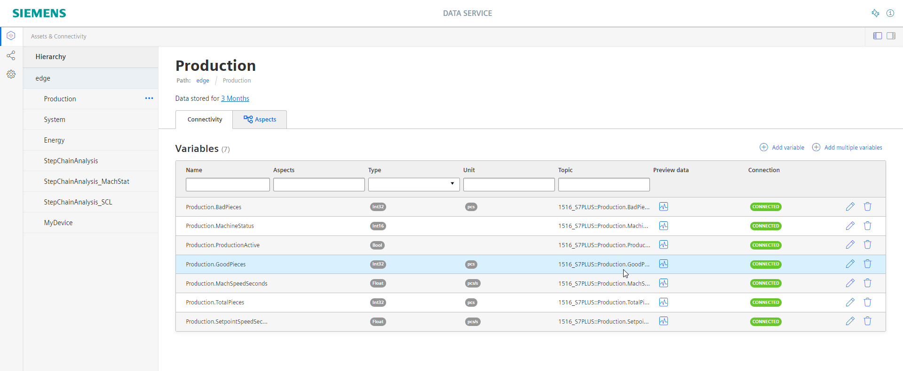
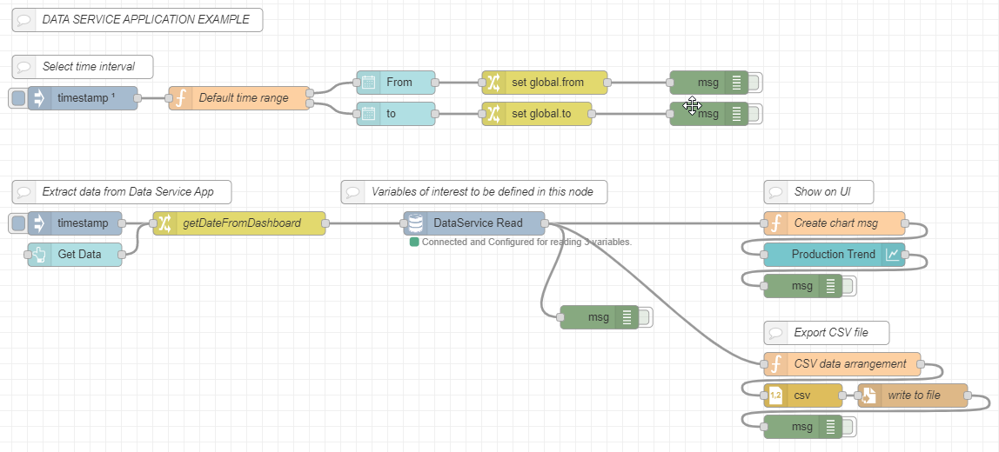
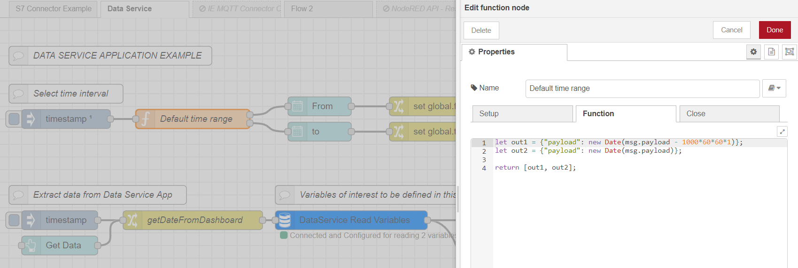
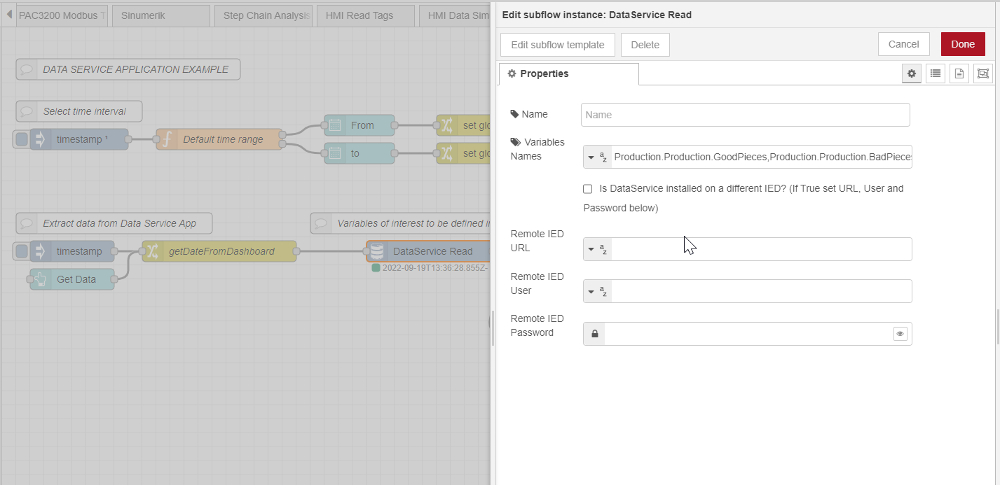
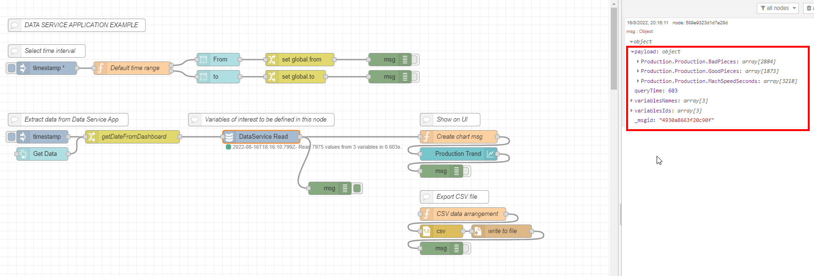
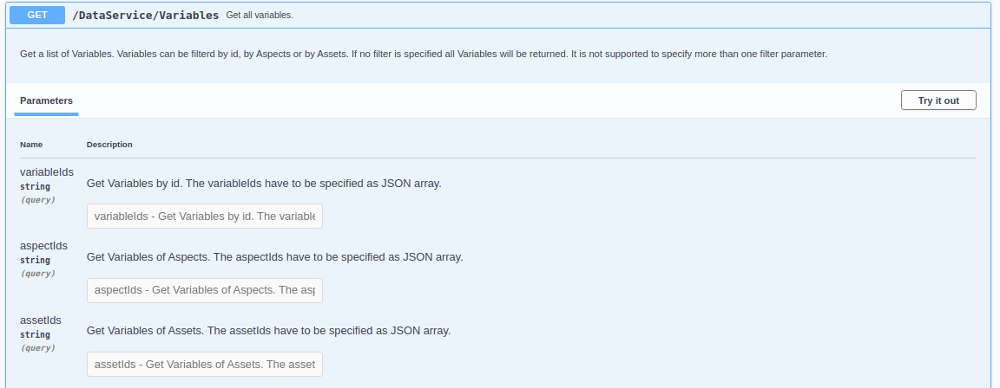
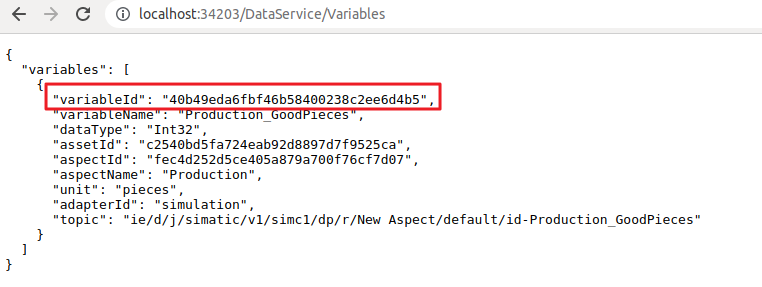
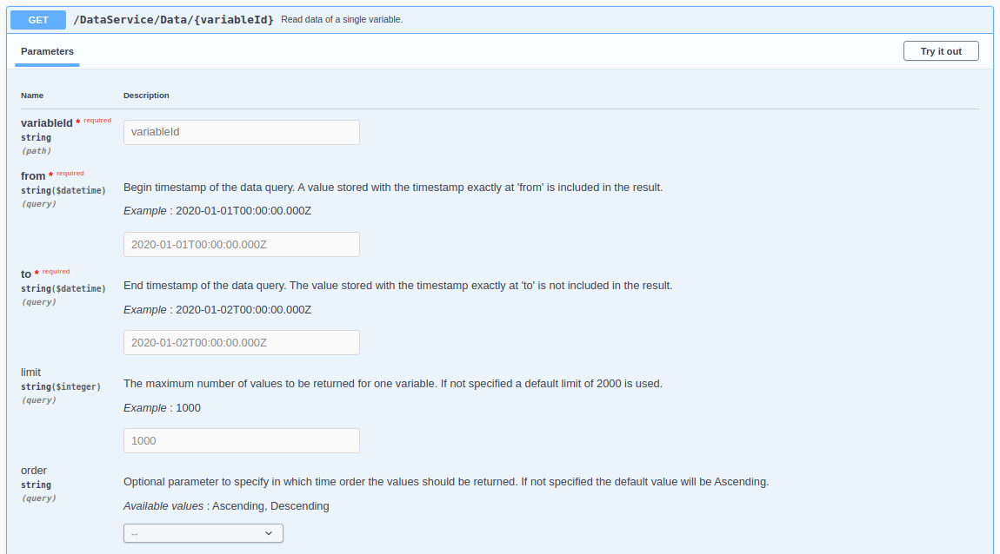
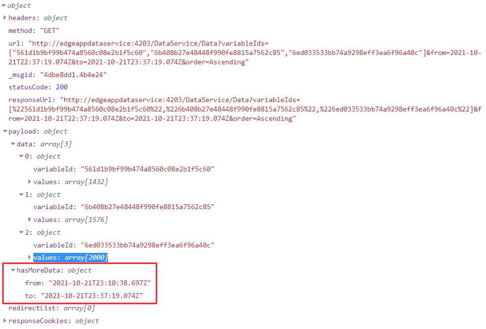

# Production data extraction and visualization in NodeRED

- [Production data extraction and visualization in NodeRED](#production-data-extraction-and-visualization-in-nodered)
  - [Description](#description)
  - [Usage](#usage)
    - [Create Tags in Data Service](#create-tags-in-data-service)
    - [Access Data via Node-RED](#access-data-via-node-red)
      - [Selection of time interval for data extraction](#selection-of-time-interval-for-data-extraction)
      - [Data retrieval from Data Service application database through APIs calls](#data-retrieval-from-data-service-application-database-through-apis-calls)
      - [Data visualization through NodeRED dashboard](#data-visualization-through-nodered-dashboard)
      - [Data saving into a CSV file](#data-saving-into-a-csv-file)
    - [DataService Read Variables node](#dataservice-read-variables-node)

## Description

This example is intended to show you how to extract data from Data Service database, how to save the extracted data into a CSV file and how to visualize them through a dedicated dashboard using NodeRED.

To do this, you will create some tags in the Data Service application and then exploit API calls to visualize the tags via NodeRED application.

For more information regarding Data Service APIs, please check **Access Data via Browser** documentation in [docs](./docs).

The tags used in this application example were integrated into Data Service application as tags configured within S7 Connector from a PLC data source.

If a PLC data source is not available, the tags can be as well created through the Simulation UI, as explained in paragraph **Create Tag in Simulation UI** for the Sinus example.

## Usage

You must carry out the following steps:

### Create Tags in Data Service

For the aim of this application example, the three tags below will be considered, representing variables associated to a production line:

| Data point id         | Description                     | Type |
| :-------------------- | :------------------------------ | :--- |
| Production.GoodPieces | Number of good pieces produced  | Int  |
| Production.BadPieces  | Number of bad pieces produced   | Int  |
| Production.MachSpeed  | Production speed in pieces/min. | Real |

To create these tags inside Data Service application, simply use _Add variable_ functionality in tab _Connectivity_.

### Access Data via Node-RED

Using the APIs exposed by Data Service, this paragraph shows how to exploit a subflow node in NodeRED to read data from Data Service application based on their tags names.

In the flow presented, the following functionalities are available:

- Selection of time interval for data extraction.
- Data retrieval from Data Service application database through APIs calls.
- Data visualization through NodeRED dashboard.
- Data saving into a CSV file.

#### Selection of time interval for data extraction

The first flow in the application example allows to set a datetime interval, that will be taken as reference for the further data extractions.
Depending on the time ranges define in _function (2)_ node below, the flow will set two global variables, `global.from` and `global.to`.

From the _inject (1)_ node, _function (2)_ node takes the current datetime as the end time, setting it as `global.to` variabile. As regards instead variable `global.from`, this is set subtracting 1 hour from the current datetime.

In this way, data extraction will consider only data of the last hour.

If needed, datetime interval can be changed in order to extract a higher volume of data from Data Service database.

#### Data retrieval from Data Service application database through APIs calls

In the main flow, the `DataService Read Variables` node takes as input the time range set in the previous paragraph, together with the list of variables configured in the properties of the node.

In fact, in `Variables Names` field of `DataService Read Variables` node, the variables of interest to be extracted from Data Service application need to be written, separated by comma and without any spaces in between.

As can be seen in the following figure, in this application example three variables of interest were configured: `Production.Production.GoodPieces`, `Production.Production.BadPieces`, `Production.Production.MachSpeed`.

After having set the variables of interest, trigger the data extraction through the inject node.

You will see status of `DataService Read Variables` node changing from "Querying data in progress" to "Query completed", receiving then an output message containing all the data points of the variables of interest.

In the output message, for each variable name, an array of objects is given.

Each object is a data point of the tag extracted from Data Service database, with a certain timestamp, value and quality code, as can be seen from the image below.

#### Data visualization through NodeRED dashboard

In order to visualize data obtained from the previously described flow, it is possible to use the Web Dashboard functionality of NodeRED together with the nodes of the `node-red-dashboard` library, dedicated to the representation of different graphical objects such as gauges, text fields and graphs.

The hereby used `charts-ui` node (`Production Trend`) allows to visualize different types of charts (lines, bars, pie) on the Web Dashboard of NodeRED, either by sending new data in real-time or by sending the whole data structure.

In the flow highlighted above, starting from the data received from `DataService Read Variables` node, the function `Create chart msg` formats all data received into the standard of `charts-ui` node, with the aim of creating a data structure for a line graph containing three time series (`Production.Production.GoodPieces`, `Production.Production.BadPieces`, `Production.Production.MachSpeed`) in the selected time interval.

Each time series formatted by the function `Create chart msg` node will contain several samples and their relative timestamps.

Below an example of the output message received from the function node `Create chart msg`:

Data of the three variables of interest can be viewed directly as three series on a line graph by connecting to the NodeRED web dashboard, as shown in the following image:

#### Data saving into a CSV file

To allow local data storage, this application example exploits `csv` node of `node-red` library to save and export a file in CSV format containing all time series of variables `Production.GoodPieces`, `Production.BadPieces`, `Production.MachSpeed` in the selected time interval.

To do this, function node `CSV data arrangement` is used to format the data received from `DataService Read Variables` node into the standard of `csv` node.

The function node, in fact, goes through all data elements, organizing them as follows:

Once the data are formatted in the correct way and sent to `csv` node, the CSV file is saved by the flow in the Application Volumes of the edge device on which the NodeRED application is installed. This operation is performed by the `file` node of `node-red` library.

To download the CSV file created, simply go to your edge device, select NodeRED application inside the _Management_ menu and click on _Download_ action. The file will be locally saved on your PC.

Below an example of CSV file saved by the flow.

### DataService Read Variables node

Let's now dive into the subflow `DataService Read Variables` node, representing the core of this application example.

Below a brief explanation is given:

1. Creation of SSL certificates for HTTPS request in case of DataService on Remote IED
2. **Inject node** to trigger the subsequent operations at start
3. Check remote or local IED for DataService connection and then create login token if remote
4. Create variables request in order to extract all variables from Data Service database.
5.  **HTTP request** node used to **GET variables data** on the following URL: `http://edgeappdataservice:4203/DataService/Variables` by the mean of the API call shown below.
    
6. Get the names of variables to be extracted from Data Service application, iterate through readed tags and get the ids of the variables of interest. Below an example of data properties and id.
    
7. Verify if variables ids and datetime ranges data are not null before requesting all the data points associated to the variables of interest.
8. Format a data request specifying an array with all the variables ids required, the start datetime, the end datetime and the variables sorting in the output data. This information will be used to compose the URL of the HTTP request of the next node. An example is:
    
9. **HTTP request** node used to **GET data of a specific variable id** on the following URL `http://edgeappdataservice:4203/DataService/Data/{variableId}` by the mean of the API call shown below.
    
    This operation will be repeated for all the variables ids explicited. The output of the HTTP request will be the following:
    
10. As marked in the figure above, the API `/DataService/Data/{variableId}` allows data reading with a maximum limit of 2000 points. To extract more datapoints it is possible to exploit the property `hasMoreData`, in which is contained the period of time with datapoints not included in the response. The aim of node (15) is to make recursive calls to the same API until the complete resolution of all the datapoints in the requested time range.
When all data points have been retrieved, data will be presented with the format shown below:

Where, for each variable extracted, the datapoints are characterized by the timestamp, value and quality code.

