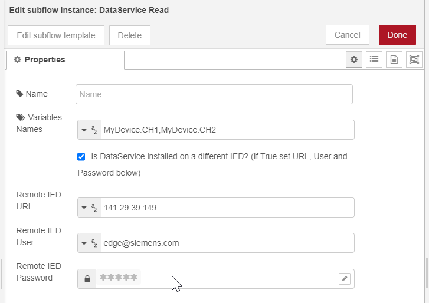

# Application Example - Read and Write Data with Subflows Nodes

- [Application Example - Read and Write Data with Subflows Nodes](#application-example---read-and-write-data-with-subflows-nodes)
  - [Description](#description)
  - [Requirements](#requirements)
  - [Usage](#usage)
    - [Import Subflows](#import-subflows)
    - [DataService Write Subflow Node](#dataservice-write-subflow-node)
    - [DataService Read Subflow Node](#dataservice-read-subflow-node)
    - [Example Flow](#example-flow)
      - [Create Custom Adapter and a Custom Asset in DataService](#create-custom-adapter-and-a-custom-asset-in-dataservice)
      - [Write Data to an Asset with DataService Write Subflow](#write-data-to-an-asset-with-dataservice-write-subflow)
      - [Read Data from an Asset with DataService Read Subflow](#read-data-from-an-asset-with-dataservice-read-subflow)
  - [Documentation](#documentation)
  - [Contribution](#contribution)
  - [License & Legal Information](#license--legal-information)

## Description

In this Application Example two custom **subflow nodes** are used to **read** and **write** data points for multiple variables from and to DataService Edge App.

Those nodes simplify the interaction with the DataService Edge App and implements all the APIs required for read and write operation.

To use the **DataService Subflows** Go to [Requirements](#requirements) section to check all the needed information, then [Import DataService Subflows](#import-subflows) in your Flow Creator / NodeRED instance. If you want to test the nodes, follow the [Example Flow](#example-flow) together with imported subflows where two variables belonging to one asset are read and written.


## Requirements

- Industrial Edge Device (IED) with firmware V1.7.0-18
- **Flow Creator** Edge App or **NodeRED** App installed on IED to run the example flow with read and write subflows
- **DataService** Edge App installed on IED to write and read data in a asset
- Subflow nodes **DataService Read** and **DataService Write** that can be imported with the example flow file [Read_Write_Subflows_Example.json](Read_Write_Subflows_Example.json)

## Usage

### Import Subflows

- Download or copy the example flow file [Read_Write_Subflows_Example.json](Read_Write_Subflows_Example.json)
- Open your Flow Creator / NodeRED instance
- Go to Menu in the upper right corner
- Press Import and browse or paste the example flow file [Read_Write_Subflows_Example.json](Read_Write_Subflows_Example.json)
- The example flow is showed up and in the **"DataService"** category of Node Palette you will find both **DataService Read** and **DataService Write** nodes:


### DataService Write Subflow Node

Subflow that implements all the APIs needed to Write variables data to DataService Edge App.


**Input Message:**

To write one or more variables, the input message has to be an **Array of Objects** where **variableName** and **values** properties has to be specified fo each variable to write.

The property **variablesName** has to be in the format `"asset_name"."variable_name"`.
For example, to write a variable called **CH1** in the Asset **MyDevice** use **MyDevice.CH1**.

The property **values** is an array of object where each data point **value**, **timestamp** and **qualitycode** properties has to be specified.
The timestamp property has to be in ISO Format (e.g. `2022-08-11T13:48:34.064Z`).
Use the qualitycode property `192` for writing good data points.

**Example input:**

```json
[
  {
    "variableName": "MyDevice.CH1",
    "values": [
      {
        "qualitycode": 192,
        "timestamp": "2022-08-11T13:48:34.064Z",
        "value": 114
      }
    ]
  },
  {
    "variableName": "MyDevice.CH2",
    "values": [
      {
        "qualitycode": 192,
        "timestamp": "2022-08-11T13:48:34.064Z",
        "value": 100
      }
    ]
  }
]
```

**Output:**

The node will return a message with the following properties:

- **payload:** `true` if data write is successfully, `false` if there was an error.
- **queryTime:** number of milliseconds elapsed for the write query
- **variablesNames:** array of the requested variables
- **variablesIds:** array of ids of the requested variables

**Example output:**

```json
{
  "payload": true,
  "queryTime": 482,
  "variablesNames": ["MyDevice.CH1", "MyDevice.CH2"],
  "variablesIds": [
    "56b571010bac431e91cd7f5bd9abef7c",
    "ca0c7878698e4885a09782f02516ab35"
  ]
}
```

### DataService Read Subflow Node

Subflow that implements all the APIs needed to read variables data from DataService Edge App based on their **names**, a **from date** and a **to date**.


**Configuration:**

Configure the variables names to be read in the property **Variables Names** of the node in the format `asset_name.variable_name` separated by commas (no spaces between names and commas, e.g. `MyDevice.CH1,MyDevice.CH2`).
For example, to read a variable called **CH1** from the Asset **MyDevice** use **MyDevice.CH1**.



**Input Message:**

Send the start and end time of the data query by the properties **from** and **to** in the input message.
Both dates has to be in ISO Format (e.g. `2022-08-11T13:48:34.064Z`).

**Example input:**

```json
{
  "from": "2021-10-10T15:00:00.000Z",
  "to": "2021-10-10T20:00:00.000Z"
}
```

**Output:**

The node will return a message with the following properties:

- **payload:** object that contains the values and timestamps for each requested variable
- **queryTime:** number of milliseconds elapsed for the query
- **variablesNames:** array of the requested variables
- **variablesIds:** array of ids of the requested variables

**Example output:**

```json
{
  "payload": {
    "MyDevice.CH1": [
      {
        "timestamp": "2022-08-10T11:42:54.506Z",
        "value": 11697,
        "qualitycode": 192
      },
      {
        "timestamp": "2022-08-10T11:42:55.506Z",
        "value": 14829,
        "qualitycode": 192
      }
    ],
    "MyDevice.CH2": [
      {
        "timestamp": "2022-08-10T11:42:54.506Z",
        "value": 12514,
        "qualitycode": 192
      },
      {
        "timestamp": "2022-08-10T11:42:55.506Z",
        "value": 11298,
        "qualitycode": 192
      }
    ]
  },
  "queryTime": 482,
  "variablesNames": ["MyDevice.CH1", "MyDevice.CH2"],
  "variablesIds": [
    "56b571010bac431e91cd7f5bd9abef7c",
    "ca0c7878698e4885a09782f02516ab35"
  ]
}
```

### Example Flow

In the example flow file [Read_Write_Subflows_Example.json](Read_Write_Subflows_Example.json) different tasks are achieved:

- Create metadata for a **custom Asset** on a custom Adapter with MQTT
- Write a batch of values to two variables with **DataService Read** node in the created custom Asset
- Read the written variables in the custom asset with **DataService Read** node

#### Create Custom Adapter and a Custom Asset in DataService

In the example flow the first part is dedicated to metadata creation for the asset `MyDevice` and the two variables `CH1` and `CH2` belonging to it.
The variables `CH1` and `CH2` will receive data from a custom **Adapter** called `MyAdapter`.


A function node will send a MQTT message through **IE Databus** with the metadata structure for a custom adapter `MyAdapter` to the metadata topic `ie/m/myadapter/dp` that will be used in the adapter configuration.

The configuration contains:

- the **name** of the device `mydevice` that will publish data
- the **data topic** where data will be published `ie/d/myadapter/dp/mydevice/default`
- the **data points definitions** for variables `CH1` and `CH2` with id, name and data type.

```js
// define metadata for one device named "mydevice" with 2 tags "CH1" and "CH2"
msg.payload = {
  seq: 1,
  connections: [
    {
      name: "mydevice",
      type: "S7",
      dataPoints: [
        {
          name: "default",
          topic: "ie/d/myadapter/dp/mydevice/default",
          publishType: "bulk",
          dataPointDefinitions: [
            {
              name: "CH1",
              id: "101",
              dataType: "Int",
            },
            {
              name: "CH2",
              id: "102",
              dataType: "Int",
            },
          ],
        },
      ],
    },
  ],
};
```

The adapter `MyAdapter` must be created within the **DataService** App before sending metadata with the flow in the example as below:


After creating adapter, press **Inject** button on the first part of the example flow to send metadata and set the configuration for the adapter `MyAdapter`.

Then is it possible to create the asset named `MyDevice` with two variables `CH1` and `CH2` within the **DataService** App:


#### Write Data to an Asset with DataService Write Subflow

The second part of the example flow is dedicated to **write** to DataService App a **simulated batch** of 10800 points for each variable, where each point is spaced 1 second apart the others. This means that the data points batch will have a range of **3 hours** from the moment when the inject button is pressed (10800 sec = 3h).


When the **function** node is triggered, the batch of data is created as input message for the **DataService Write** node as specified in the section [DataService Write Subflow Node](#dataservice-read-subflow-node) above.
Below the code of the function block where the **variables names** to be written are specified within the array `varNames` and the number of simulated data points for each variable is set with the function variable `tagsNum`:

```js
// simulate data payload

// function to get random integers between a min and a max
function getRandomIntBetween(min, max) {
  return parseInt(Math.random() * (max - min + 1) + min);
}

// THE NUMBER OF TAGS FOR EACH VARIABLE TO BE CREATED
let tagsNum = 10000;
// THE NAMES OF THE TAGS TO BE WRITTEN
let varNames = ["MyDevice.CH1", "MyDevice.CH2"];

// create a timestamp with ms precision
let d = new Date();
let epoch = d.getTime();
// init payload
msg.payload = [];

// for each configured variable
for (let i = 0; i < varNames.length; i++) {
  // init values
  let values = [];
  // based on number of tags
  for (let j = tagsNum; j >= 0; j--) {
    // push data from the oldest to the newest
    let ts1 = new Date(epoch - 1000 * j).toISOString();
    values.push({
      qualitycode: 192,
      timestamp: ts1,
      value: getRandomIntBetween(100, 150),
    });
  }
  // set values for the actual variable
  msg.payload.push({
    variableName: varNames[i],
    values: values,
  });
}

return msg;
```

When the **DataService Write** node is triggered from the batch of simulated data, it will write all the points to the specified **asset** and then output a message that will contains the write status and information. See output example in the section [DataService Read Subflow Node](#dataservice-read-subflow-node) above.

#### Read Data from an Asset with DataService Read Subflow

The last part of the example flow shows how to **read variables** data points from DataService App, in a specified time range, using the **DataService Read** Subflow Node.


The **DataService Read** node is configured to read the variables `MyDevice.CH1` and `MyDevice.CH2` in the property **Variables Names** of the node as specified in the section [DataService Read Subflow Node](#dataservice-read-subflow-node) above.

When the **function** node is triggered, the time range properties `from` and `to` are created as input message for the **DataService Read** node, as specified in the section [DataService Read Subflow Node](#dataservice-read-subflow-node) above.

Below the code of the function block where a **3 hours time range** is set by specifying the `to` property as now and the `from` property as 3 ours ago:

```js
// get actual date
let d = new Date();
// set to as now
msg.to = d.toISOString();
// set from as 3 hours ago
msg.from = new Date(d.getTime() - 3 * 3600 * 1000).toISOString();

return msg;
```

When the **DataService Read** node is triggered, the received **output message** will contains all the data points belonging to the configured variables in the specified time range. See output example in the section [DataService Read Subflow Node](#dataservice-read-subflow-node) above.

## Documentation

- [DataService Manual](https://support.industry.siemens.com/cs/it/en/view/109781417)
- [GitHub DataService Getting Started](https://github.com/industrial-edge/data-service-getting-started)
- [GitHub DataService Development Kit Getting Started](https://github.com/industrial-edge/data-service-development-kit-getting-started)

You can find further documentation and help about Industrial Edge in the following links:

- [Industrial Edge Hub](https://iehub.eu1.edge.siemens.cloud/#/documentation)
- [Industrial Edge Forum](https://www.siemens.com/industrial-edge-forum)
- [Industrial Edge landing page](https://new.siemens.com/global/en/products/automation/topic-areas/industrial-edge/simatic-edge.html)
- [Industrial Edge GitHub page](https://github.com/industrial-edge)
- [Industrial Edge App Developer Guide](https://support.industry.siemens.com/cs/ww/en/view/109795865)

## Contribution

Thanks for your interest in contributing. Anybody is free to report bugs, unclear documentation, and other problems regarding this repository in the Issues section or, even better, is free to propose any changes to this repository using Merge Requests.

## License & Legal Information

Please read the [Legal Information](../LICENSE.md).
